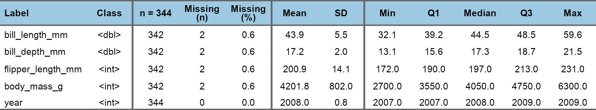
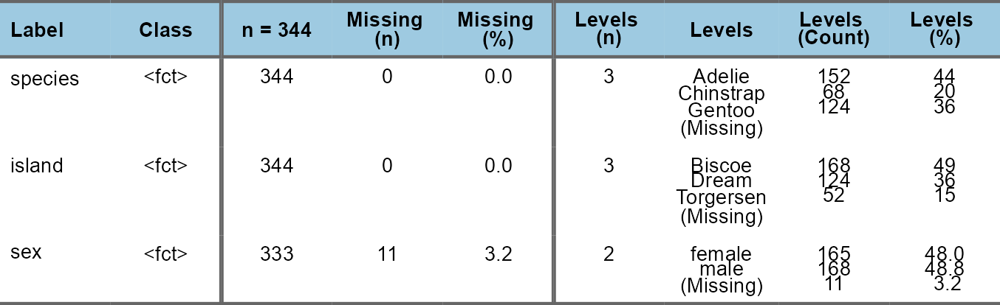
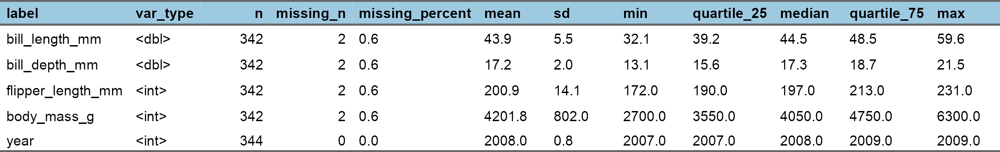
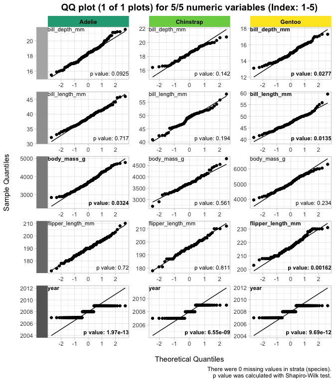
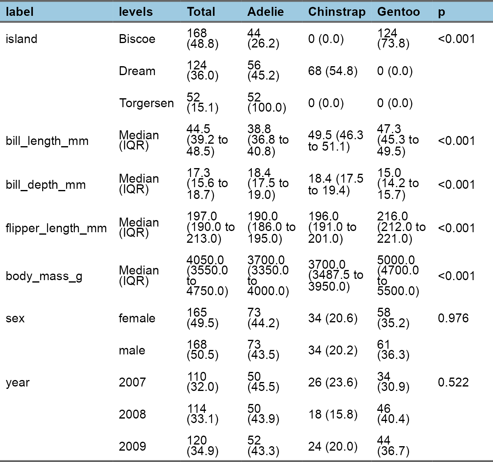
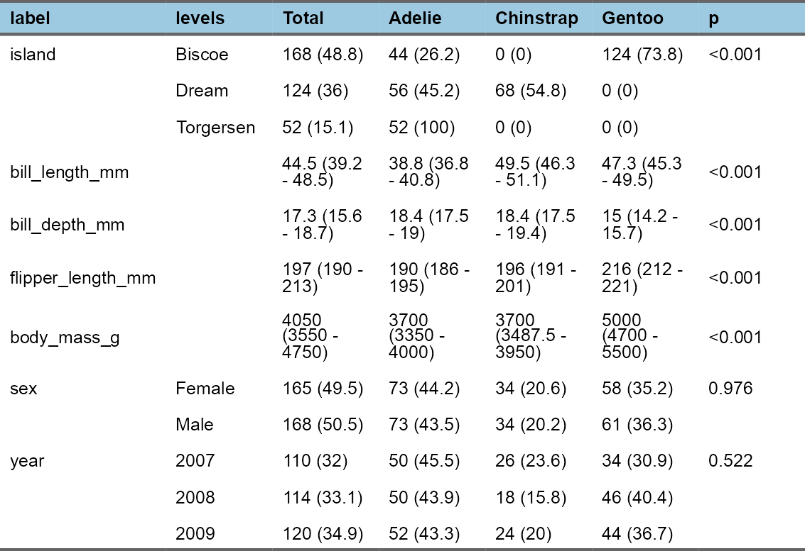
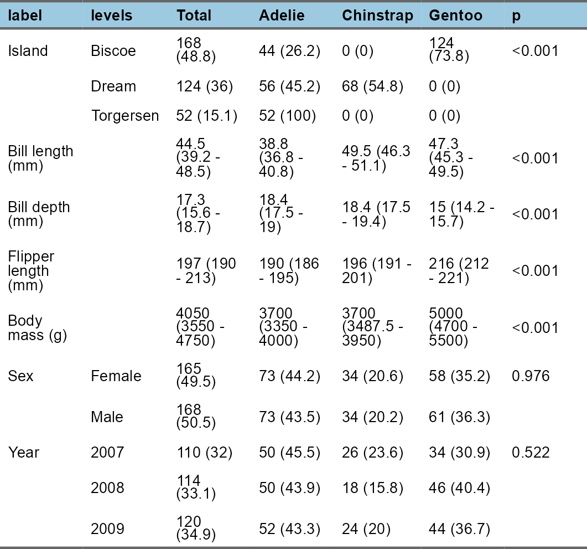

<!-- README.md is generated from README.Rmd. Please edit that file -->

# RforMD <a href="https://aligunermd.github.io/RforMD/"></a>

<!-- badges: start -->
<!-- badges: end -->

`{RforMD}` aims to provide some functions for personal use.  
Surely, any academic in medicine, can use any.  
I am open to improve. Do not hesitate for requests/issue reports.

## Installation

You can install the development version of RforMD from
[GitHub](https://github.com/) with:

``` r
# install.packages("remotes")
remotes::install_github("AliGunerMD/RforMD")
library("RforMD")
```

## Example use

``` r

# remotes::install_github("AliGunerMD/RforMD", force = TRUE)
library(RforMD)
library(palmerpenguins)
library(tidyverse)

strata <- "species"
table_vars_penguins <- penguins %>% 
        select(-species) %>% 
        names()


# library(finalfit)
# library(flextable)
```

The idea of this package comes from the personal needs.  
The [finalfit](https://finalfit.org) package is one of the most useful
package for a researcher who works in medicine.  
It provides great functionalities. I just want to improve some parts of
them, so, try to extent it to save some time.

Later, I also added some functions for
[flextable](https://ardata-fr.github.io/flextable-book/) with the same
idea. to make faster and totally reproducible Word tables.  
If you are happy with html output, try [gt](https://gt.rstudio.com/),
[gtsummary](https://www.danieldsjoberg.com/gtsummary/),
[gtExtras](https://jthomasmock.github.io/gtExtras/) packages.

<br> All analysis starts with the exploration of data.  
Among many options like `summary()`, `str()`, `dplyr::glimpse()`,
`skimr::skim()`;  
I prefer `finalfit::ff_glimpse()` with some modifications.

### ag_ff_glimpse()

#### Continuous variables

``` r
ag_ff_glimpse(penguins, type = "cont")
```



#### Categorical variables

``` r
ag_ff_glimpse(penguins, type = "cat") 
```



#### Categorical variables with strata

``` r
ag_ff_glimpse(penguins, type = "cat", strata = "sex", missing = TRUE) 
```



### ag_shapiro()

``` r
ag_shapiro(penguins, strata = strata, table_vars = table_vars_penguins)
#> Shapiro-Wilk test results for normality within strata:
#> Checked variables: bill_length_mm, bill_depth_mm, flipper_length_mm, body_mass_g, year
#> Stratified by: species
#> Non-normally distributed variables: body_mass_g, year, bill_length_mm, bill_depth_mm, flipper_length_mm
#> [1] "body_mass_g"       "year"              "bill_length_mm"   
#> [4] "bill_depth_mm"     "flipper_length_mm"
```

``` r
ag_shapiro_results(penguins, strata = strata, table_vars = table_vars_penguins,
                   scientific = TRUE) %>% 
        ag_flex()
```


### ag_qq_plots()

``` r
ag_qq_plots(penguins, strata = strata, table_vars = table_vars_penguins)
```



### ag_ff_summary()

``` r
ag_ff_summary(penguins, strata = strata, table_vars = table_vars_penguins) %>% 
        ag_flex()
```


### ag_ff_relocate()

``` r
ag_ff_summary(penguins, strata = strata, table_vars = table_vars_penguins) %>% 
        ag_ff_relocate(order = "TGP") %>% 
        ag_flex()
#> Relocated columns:label -- levels -- Total -- Adelie -- Chinstrap -- Gentoo -- p
```



### ag_ff_columns()

``` r
ag_ff_summary(penguins, strata = strata, table_vars = table_vars_penguins) %>% 
        ag_ff_relocate(order = "TGP") %>% 
        ag_ff_columns(levels = TRUE) %>% 
        ag_flex()
#> Relocated columns:label -- levels -- Total -- Adelie -- Chinstrap -- Gentoo -- p
#> Manual check may be needed for some levels.
```



### ag_ff_labels()

``` r
penguins_names <- c(
        "island" = "Island",
        "bill_length_mm" = "Bill length (mm)",
        "bill_depth_mm" = "Bill depth (mm)",
        "flipper_length_mm" = "Flipper length (mm)",
        "body_mass_g" = "Body mass (g)",
        "sex" = "Sex",
        "year" = "Year"
)

ag_ff_summary(penguins, strata = strata, table_vars = table_vars_penguins) %>% 
        ag_ff_relocate(order = "TGP") %>% 
        ag_ff_columns(levels = TRUE) %>% 
        ag_ff_labels(use_vector = TRUE, vector_name = penguins_names) %>% 
        ag_flex()
#> Relocated columns:label -- levels -- Total -- Adelie -- Chinstrap -- Gentoo -- p
#> Manual check may be needed for some levels.
#> A vector for variable names was used to rename labels.
```



``` r
summary_flextable <- ag_ff_summary(penguins, strata = strata, table_vars = table_vars_penguins) %>% 
        ag_ff_relocate(order = "TGP") %>% 
        ag_ff_columns(levels = TRUE) %>% 
        ag_ff_labels(use_vector = TRUE, vector_name = penguins_names) %>% 
        ag_flex()
#> Relocated columns:label -- levels -- Total -- Adelie -- Chinstrap -- Gentoo -- p
#> Manual check may be needed for some levels.
#> A vector for variable names was used to rename labels.
```
